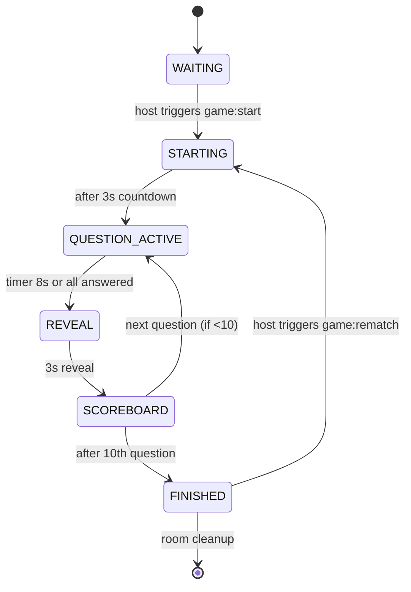

# Implementation Plan for **Qlyvora** (v2)

---

## 1. Final Technology Stack (locked decisions confirmed)
| Layer | Choice | Rationale |
|------|--------|-----------|
| Language | **TypeScript** (frontend & backend) | Shared types, single‑language codebase |
| Frontend | **React + Vite + TS** – React Router, plain CSS (CSS variables / CSS Modules) | Small bundle, fast HMR, no heavyweight UI lib |
| Backend | **Node 20+ + Express + Socket.IO** | Mature WebSocket library with graceful fallback, room support |
| Real‑time transport | **Socket.IO** (WebSocket first, long‑polling fallback) | Works on restrictive mobile networks, automatic reconnection |
| State storage | **In‑memory `RoomStore`** (`InMemoryRoomStore`) behind `RoomStore` interface | Simplicity for MVP, easy swap to Redis later |
| Monorepo layout | **npm workspaces** – `client/`, `server/`, `shared/` | Shared types/constants, single `package.json` for scripts |
| Testing | Vitest (unit), socket.io‑client bots (integration), Playwright (E2E), axe‑core (a11y) | Full coverage across layers |
| Hosting | Single web service (e.g. **Render**, Railway, Fly.io) serving static client build *and* Socket.IO API from same origin | Avoids CORS/mixed‑origin, one public URL |

All locked decisions from §2 are kept; no blockers identified.

---

## 2. Realtime Architecture & Why Socket.IO
- **Server‑driven timers**: the server owns phase durations (STARTING, QUESTION, REVEAL, SCOREBOARD) and drives transitions.
- **Versioned state snapshots**: after any change the server emits a full sanitized snapshot with an incrementing `version`. Clients discard older versions – robust against packet loss/reorder.
- **Per‑player view**: snapshot never contains another player’s pending answer or the correct answer before REVEAL.
- **Acknowledged events**: all client → server events are acknowledged (`{ ok, error? }`). Retries are handled by the client.
- **Fallback**: Socket.IO automatically falls back to HTTP long‑polling when WebSockets are blocked, guaranteeing connectivity on all browsers and devices.

### Advantage over alternatives
| Alternative | Issue for MVP |
|------------|----------------|
| Colyseus / PartyKit | Extra abstraction, requires Redis adapter for scaling; adds build complexity |
| Server‑sent events / polling | No bi‑directional low‑latency messages; harder to handle reconnection & room semantics |
| Pure WebSocket library | Need to implement fallback & reconnection manually |

---

## 3. Storage Approach & Limits
- **`RoomStore` interface** defines `createRoom`, `getRoom`, `deleteRoom`, `listRooms`.
- **`InMemoryRoomStore`** keeps a `Map<string, Room>` in the Node process.
- **Limits**: max 8 players/room, max 2‑minute idle time before auto‑close, max 30‑minute lobby idle, max 15‑minute finished‑room retention.
- **Scalability note**: swapping to a Redis‑backed implementation will be a one‑line change (implement same interface).

---

## 4. State Machine Diagram


---

## 5. Protocol – Events
### Client → Server (all ACKed)
- `room:create { name }`
- `room:join { code, name }`
- `room:rejoin { code, sessionToken }`
- `room:leave`
- `game:start`
- `answer:submit { questionId, optionIndex }`
- `game:rematch`

### Server → Client (broadcast to room)
- `room:state { snapshot }` – full sanitized state, version, `serverNow`.
- `toast { code, message }` – transient UI messages.
- `ping/pong` – optional keep‑alive.

All payloads conform to the TypeScript definitions in `shared/src/protocol.ts`.

---

## 6. Core Data Models (Typescript interfaces)
```ts
// shared/src/types.ts
export interface Player {
  id: string; // UUID
  name: string;
  isHost: boolean;
  sessionToken: string; // 128‑bit random, issued on join
  connected: boolean;
  score: number;
  answers: Record<string, AnswerRecord>; // questionId → answer info
}

export interface Question {
  id: string;
  category: string;
  text: string;
  options: string[4];
  correctIndex: number; // server‑only
  difficulty: 'easy' | 'medium' | 'hard';
}

export interface GameState {
  phase: 'WAITING' | 'STARTING' | 'QUESTION_ACTIVE' | 'REVEAL' | 'SCOREBOARD' | 'FINISHED';
  currentQuestion?: Question;
  questionIndex: number; // 0‑based
  endsAt: number; // epoch ms per server clock
  version: number;
}
```
(Full definitions will live in `shared/src/protocol.ts`.)

---

## 7. Security Model (summary)
- **Input validation** on every socket payload (names, codes, option indices, etc.).
- **Rate limiting** per‑socket (≈10 events/sec) and per‑IP for room creation/join.
- **Helmet** with CSP `default-src 'self'; script-src 'self'; style-src 'self' 'unsafe-inline'; img-src data:`.
- **CORS** limited to the same origin (server and client share origin).
- **No secrets** in client bundle; `.env.example` only.
- **Server authority**: scores, phases, correct answers, host rights are never trusted from client.

---

## 8. Folder Structure (final)
```
qlyvora/                 (root – will be created)
├─ package.json          (workspaces config)
├─ pnpm-lock.yaml / yarn.lock (optional)
├─ shared/
│   └─ src/
│       ├─ types.ts
│       ├─ protocol.ts
│       └─ config.ts
├─ server/
│   └─ src/
│       ├─ index.ts                (Express + Socket.IO bootstrap)
│       ├─ rooms/
│       │   ├─ RoomStore.ts
│       │   └─ InMemoryRoomStore.ts
│       ├─ game/
│       │   ├─ stateMachine.ts
│       │   ├─ scoring.ts
│       │   └─ snapshots.ts
│       ├─ questions/
│       │   ├─ QuestionProvider.ts
│       │   └─ general-knowledge.ts
│       └─ security/
│           ├─ validation.ts
│           └─ rateLimit.ts
├─ client/
│   └─ src/
│       ├─ main.tsx
│       ├─ App.tsx
│       ├─ routes/
│       ├─ components/
│       ├─ services/
│       │   └─ socket.ts
│       └─ styles/ (CSS variables, modules)
├─ e2e/            (Playwright specs)
├─ scripts/        (bot‑player scripts for integration testing)
├─ docs/
│   ├─ ARCHITECTURE.md
│   ├─ TEST_REPORT.md
│   └─ DEPLOYMENT.md
└─ README.md
```
All new directories will be created during the first commit.

---

## 9. Milestone Plan & Acceptance Criteria
| Milestone | Goal | Acceptance (what we will record) |
|----------|------|---------------------------------|
| **0 – Foundation** | Init monorepo, lint, formatter, basic Vite+React shell, theme tokens, Welcome screen. | `git commit -m "chore: initialise repo"`; screenshots of Welcome page; `npm run lint` passes.
| **1 – Rooms** | Create/join flow, lobby UI, deep‑link, code generation, player list sync, host badge. | Two independent browsers can create and join a room; lobby shows exact same code and player list; `docs/TEST_REPORT.md` entry with evidence.
| **2 – Core Game** | Host can start, server drives countdown, questions broadcast, answer submission validated, scoring applied. | Play two tabs, answer differently, verify scores after reveal; evidence via Playwright screenshot/video.
| **3 – Multiplayer Sync** | Early‑close when all answer, versioned snapshots, reconnect handling, host transfer on disconnect. | Simulated disconnects (via dev tools) and re‑connects; host leaves → new host appears; `docs/TEST_REPORT.md` logs.
| **4 – Results & Rematch** | Final scoreboard, winner tie‑break, rematch resets state, new question set. | Full game (10 Q) ends, winner displayed correctly, clicking *Play Again* restarts without page reload.
| **5 – Resilience** | Grace periods, cleanup timers, friendly error UI, connection banner, reconnection UI. | Forced network loss → banner appears, later disappears; room auto‑closes after idle; logs verified.
| **6 – Polish** | Animations, muteable sound, accessibility (keyboard, aria‑live, contrast), responsive layout on all breakpoints. | Axe‑core scan → 0 violations; manual keyboard test; visual diff screenshots for each breakpoint.
| **7 – Testing Suite** | Complete unit, integration, E2E tests; `docs/TEST_REPORT.md` contains table with PASS/FAIL and artefacts. | CI run (`npm test`) passes; report generated.
| **8 – Production Build** | Optimised bundle (< 300 KB gzipped), no console statements, env config, health endpoint, no dev flags. | `npm run build` succeeds; bundle size logged; `curl https://<url>/healthz` returns 200.
| **9 – Deployment** | Deploy to chosen host, public URL reachable on desktop and phone, smoke test passes. | Live URL shared; Playwright smoke test against it passes; screenshot evidence.

---

## 10. Two‑Independent‑Player Test Plan (Gate B)
1. **Setup**: `npm run dev` (starts Express+Socket.IO on port 3000, Vite dev server proxies). Two Chrome profiles opened in separate windows.
2. **Create** → **Join** using generated code.
3. **Start Game** (host). Verify countdown sync.
4. **Answer**: Player A chooses correct option instantly; Player B chooses wrong option after 4 s.
5. **Verify**:
   - After REVEAL both see same correct answer.
   - Scores: A = 150, B = 0 (or speed‑bonus applied).
   - Server version increments exactly once per phase.
6. **Early‑close**: When both have answered before timer, server skips to REVEAL immediately – ensure no extra timer delay.
7. **Evidence**: Playwright script records console logs, screenshots of each phase, and writes `docs/evidence/gateB_{timestamp}.png`.

---

## 11. Production Test Plan (Gate D)
1. Deploy to **Render** (Node Service) with build command `npm run build && npm start`.
2. Verify health endpoint (`/healthz`).
3. Open public URL on **laptop** (Chrome) → create a game.
4. On **phone** (iOS/Android) using cellular data, join via deep‑link/QR.
5. Play a full 10‑question game, using both devices. Record a short video (`docs/evidence/production_play.mp4`).
6. After game ends, click **Play Again** (host) → ensure new questions appear and scores reset.
7. Refresh both browsers mid‑lobby and mid‑game → state persists correctly.
8. Test offline → confirm banner “Reconnecting…” appears and recovers.
9. Run the same Playwright smoke test against the live URL (CI script) and capture results.

---

## 12. Deployment Plan
| Step | Action | Command / Config |
|------|--------|-------------------|
| **1** | Create a **Render** (or Railway/Fly.io) *Web Service* named `qlyvora`. Set *Root Directory* to the repo root. |
| **2** | Set **Build Command**: `npm ci && npm run build` |
| **3** | Set **Start Command**: `node server/dist/index.js` (or `npm start` if using a script). |
| **4** | Add environment variables:
&nbsp;&nbsp;- `PORT=10000` (or default Render port `$PORT`)
&nbsp;&nbsp;- `NODE_ENV=production`
&nbsp;&nbsp;- `ORIGIN=https://<service>.onrender.com` (used by Socket.IO CORS) |
| **5** | Enable **Health Checks** on `/healthz`. |
| **6** | After first deploy, obtain the public URL and add it to `README.md` and `docs/DEPLOYMENT.md`. |
| **7** | Configure a **cron** (optional) to ping the URL every 5 min to keep free tier awake. |

**What I need from you**:
- Access to a hosting provider account (Render, Railway, Fly.io, etc.) or the preferred platform.
- Desired region (e.g., `us-east`, `eu-west`) for lower latency.
- Optional: GitHub repository URL where the code will be pushed.

---

## 13. Assumptions & Open Questions
| Assumption | Question for you |
|------------|------------------|
| You have a **GitHub** repo or will create one for this project. | Which repo URL should I push the initial monorepo to? |
| Hosting will be on **Render** (or similar). | Do you have a Render account, or prefer another provider? |
| You are fine with Node 20 runtime and npm. | Any constraints on Node version or package manager (pnpm, yarn)? |
| No custom domain required for MVP. | Should we configure a custom domain later? |
| You will provide CI integration (GitHub Actions) later if desired. | Do you need CI pipelines now, or can we add them after the first milestone? |

---

**Next step** – Await your approval of this Implementation Plan before any code is written.

---
